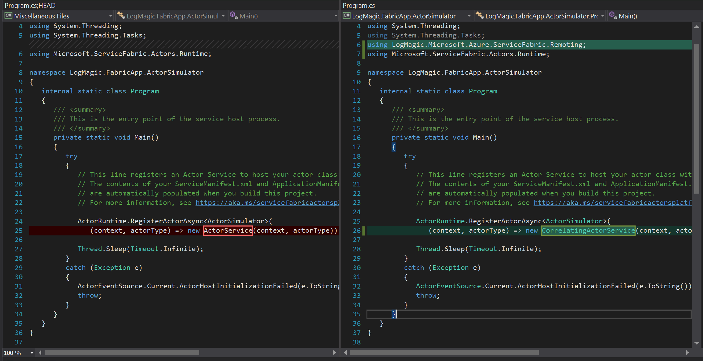
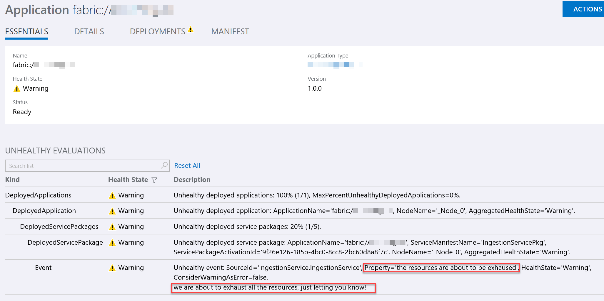
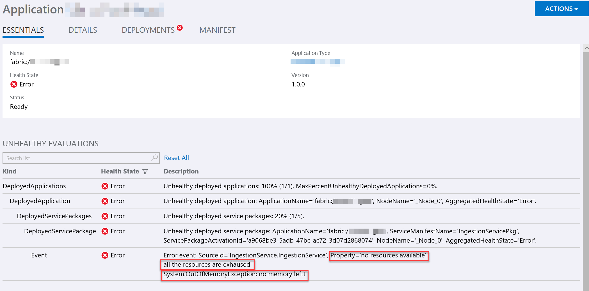

# Microsoft Service Fabric

There are two streams of NuGet packages for Service Fabric support:
- 5.6.x - targeting Azure Service Fabric 5.6 and supporting Remoting v1 only and .NET 4.6.1 only. This package has reached a stable phase and is not currently being worked on as remoting v1 is getting deprecated.
- 6.1.x - targeting Azure Service Fabric 6.1 and supporting Remoting v2 only as v1 was removed and targeting .NET Core 2.0 and .NET 4.6.1.

To install the integration install this [NuGet package](https://www.nuget.org/packages/LogMagic.Microsoft.Azure.ServiceFabric/).

This package provides two ways of integrating with Service Fabric - [enrichment](#enrichment), [correlating proxies](#correlating-proxies), and [health reports](#health-reports)

## Encrichment

To configure enrichment use the following syntax:

```csharp
L.Config
  .EnrichWith.AzureServiceFabricContext(this.Context);
```

where `Context` is your current service's `ServiceContext`. Normally you would initialise logging during service creation, for example in a service's constructor, where context is available:

```csharp
public MyService(StatefulServiceContext context)
    : base(context)
{
  L.Config.ClearWriters();

  L.Config
    .WriteTo.Trace()
    .EnrichWith.AzureServiceFabricContext(this.Context);
}
```

In the example above logging is written to standard trace and enriched with Service Fabric properties.

During enrichment the following properties are injected:

- **ServiceFabric.ServiceName**. The address of the deployed service.
- **ServiceFabric.ServiceTypeName**. Service type as it appears in the manifest.
- **ServiceFabric.PartitionId**. Partition ID.
- **ServiceFabric.ApplicationName**. The address of the application this service is contained in.
- **ServiceFabric.ApplicationTypeName**. Type of the application this service is contained in.
- **ServiceFabric.NodeName**. Name of the node this service runs on.

For stateless services another property is injected:

- **ServiceFabric.InstanceId**. Service instance ID.

And for stateful service there is another extra property:

- **ServiceFabric.ReplicaId**. Replica ID.

An example of those property values:


## Correlating proxies

Logging becomes more complicated when you want to track calls between services, actors or a mix of them. LogMagic includes a way to track operations between services called **correlating proxies**. This includes support for the built-in Service Remoting protocol out of the box, and you can easily add your own protocol based on source code.

The whole idea is based on capturing current executing context. Please refere to the [main page](../../README.md) to read about how to add context information.

Ideally you would like to capture the context and when making a call to another service, transfer it to another service. You can do it, of course, by adding a method parameter on your service interface like `Task DoWork(Dictionary<string, string> context, other parameters)`, however this becomes really tedious and just not cool. Service Fabric doesn't capture the context automatically because it doesn't know about LogMagic, and frankly, about any other logging framework therefore you'll end up with a situation like this:


LogMagic can solve this problem for you really easily by capturing the current context, and adding it to all outgoing calls for a specific client.

All you have to do is

### Create a correlating client

Usually with raw Service Fabric you would create a remoting proxy in your code by calling a following piece of code:

```csharp
IRemoteServiceInterface = ServiceProxy.Create<IRemoteServiceInterface>(serviceUri, ...);
```

In order to capture the call context all you have to do is change `ServiceProxy` to `CorrelatingServiceProxy`, that's it:

```csharp
IRemoteServiceInterface = CorrelatingServiceProxy.Create<IRemoteServiceInterface>(serviceUri, ...);
```

or to call an Actor:

```csharp
IActorInterface actorProxy = CorrelatingActorProxy.Create<IActorInterface>(actorId, actorUri, ...);
```

> note that Actors integration are not supported in v6 version yet.

We've kept method signatures identical to the ones Service Fabric SDK has, therefore no of the parameters have to change!

After you do this you'll end up with a situation like this:


The correlating proxy will intercept the calls for the specific proxy, capture current context, add it to the outgoing call and send to the remote service. The context will reach the remote service, will be deserialized by the built-in Service Fabric message handler and give control to your service, discarding all the extra context we've passed. And that's OK, because the remote service doesn't know how to handle those extra headers we've included.

### Create a correlating message handler

The good news is LogMagic includes an ability to automatically capture it. In order for this to work, you need to set up a few things first. However this library is called Log**Magic** and I've tried to make it a magic. The techniques a slightly different between remoting v1 and v2.

#### Remoting v2

On the listener service you would normally set up remoting using the following code:

```csharp
protected override IEnumerable<ServiceInstanceListener> CreateServiceInstanceListeners()
{
   return new ServiceInstanceListener[]
   {
      new ServiceInstanceListener(c => new FabricTransportServiceRemotingListener(c, new FabricRemotingMessageHandler(Context, new MyServiceInstance())))
   }
}
```

which can be replaced by:

```csharp
protected override IEnumerable<ServiceInstanceListener> CreateServiceInstanceListeners()
{
   return new ServiceInstanceListener[] { this.CreateCorrelatingServiceInstanceListener(new MyServiceInstance()) };
}
```

note that with remoting v2 you have to pass an instance of your service implementation which derives from `IService`. Apparently if you are implementing it in the service class itself (which is a bad idea anyway) you can simply pass `this`.

or in case of a stateful service:

```csharp
protected override IEnumerable<ServiceInstanceListener> CreateServiceInstanceListeners()
{
   return new ServiceInstanceListener[] { this.CreateCorrelatingServiceReplicaListener(new MyServiceInstance()) };
}
```

or in case of Actors

> implementation pending


#### Remoting v1

On the listener service you would normally set up remoting using the following code:

```csharp
protected override IEnumerable<ServiceReplicaListener> CreateServiceReplicaListeners()
{
    return new[] { new ServiceReplicaListener(context => this.CreateServiceRemotingListener(context)) };
}
```

To make it aware of the context the code looks even simpler:

```csharp
protected override IEnumerable<ServiceReplicaListener> CreateServiceReplicaListeners()
{
    return new[] { this.CreateCorrelatingReplicaListener() };
}
```
or in case of a stateless service:

```csharp
protected override IEnumerable<ServiceInstanceListener> CreateServiceInstanceListeners()
{
    return new[] { this.CreateCorrelatingInstanceListener() };
}
```

Or in case of Actors you'll need to into actor's project `Program.cs` and change ActorService ro CorrelatingActorService:



### Technique

The way LogMagic does this is by transferring two properties called _operationId_ and _operationParentId_ between service calls. _operationId_ value is captured before the call is issued to the remote service (if it's present) and the remote service does the following:

- Picks up the value of _operationId_.
- Creates a new call context by generating a new unique value for _operationId_.
- Sets context property _operationParentId_ to the old value of _operationId_.
- In addition to that, both client and server maintains exact values of all context properties on both sides.

After that's all done, context information will be taken from the client, restored on the server and the magic continues.


## Health Reports

[Health Monitoring](https://docs.microsoft.com/en-us/azure/service-fabric/service-fabric-health-introduction) is a standard features in Service Fabric which generates a cluster reports when something bad happens. You can see health reports visually in Service Fabric Explorer, however most of the time you are only seeing system reports. It would be pretty awesome to send your own information here, however it requires you to use Service Fabric API and propagate the dependencies across the application. LogMagic solves this in a uniqueue way.

First of all, in order to enable Health Report writer, you simply add it to LogMagic configuration:

```csharp
L.Config.WriteTo.AzureServiceFabricHealthReport(this.Context);
```

This is all you need to do to hook up health report writer! By default non of the events are written to health report. Why? Well, because health reporting must be a **rare** event, unlike tracing. You should really minimise the amount of calls to report health.

Health Report writer only writes trace calls that have a property `KnownProperty.ClusterHealthProperty` set, which itslef must be set to a helth report short reason. Health Report description will be set to the trace message, which will also contain exception details if exception has occurred.

If exception is present in the trace message, health state will be reported as `Error`, otherwise it's a `Warning` message. There is no other reason to send a health report if nothing is wrong.

Here is an example of sending a health report reporting a warning:

```csharp
using (L.Context(new KeyValuePair<string, string>(KnownProperty.ClusterHealthProperty, "the resources are about to be exhaused")))
{
   log.Trace("we are about to exhaust all the resources, just letting you know!");
}
```

and the one reporting an error:

```csharp
using (L.Context(new KeyValuePair<string, string>(KnownProperty.ClusterHealthProperty, "no resources available")))
{
   log.Trace("all the resources are exhaused", new OutOfMemoryException("no memory left!"));
}
```

in this report I'm creating an `OutOfMemoryException` directly just as an example, however in real life the exception most probably will originate from your application.

Here is how they look like in SF Explorer:

### Warning



### Error




> The health is reported for current **deployed service package**.

